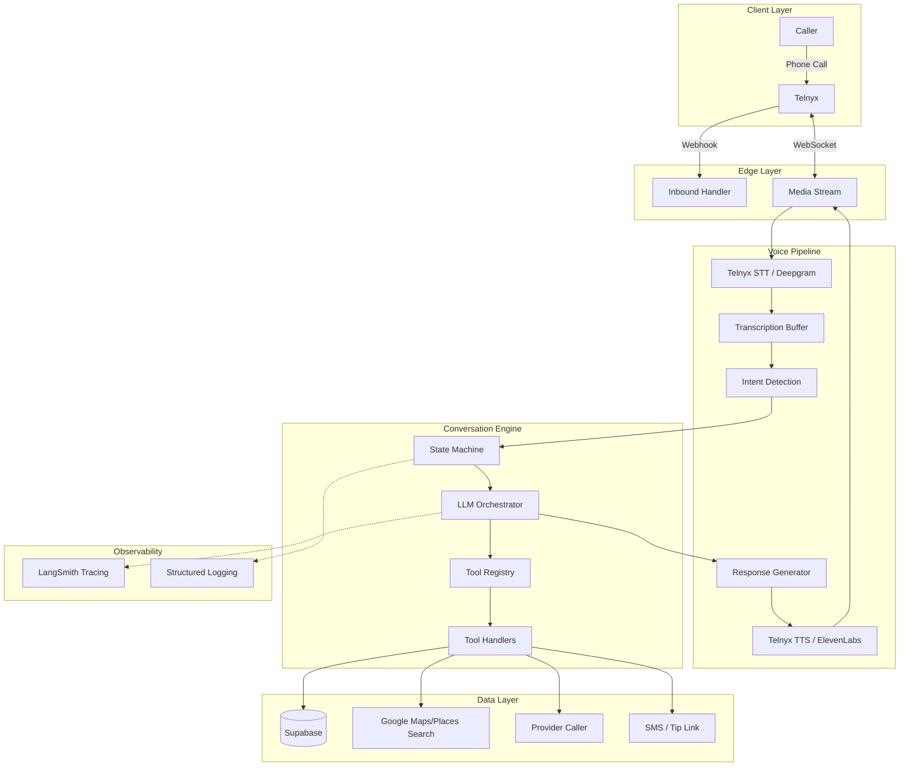

# System Architecture

This document describes the architecture of OpenClaw — Service Matchmaker.

## Overview

An AI-powered phone concierge that finds and connects callers with local service providers. Users call a Telnyx phone number, describe what they need, and the agent searches for providers, calls them, then live-transfers the caller to the best match.

## Architecture Diagram



## Component Details

### 1. Voice Pipeline

Real-time audio processing via Telnyx Call Control v2:

```
┌─────────────┐     ┌─────────────┐     ┌─────────────┐
│   Telnyx    │────▶│   STT       │────▶│   Buffer    │
│   Call      │     │   Engine    │     │   (1.5s)    │
│   Control   │     │             │     │             │
└─────────────┘     └─────────────┘     └─────────────┘
                                               │
                                               ▼
┌─────────────┐     ┌─────────────┐     ┌─────────────┐
│   Telnyx    │◀────│   TTS       │◀────│    LLM      │
│   Playback  │     │   Engine    │     │   Response  │
└─────────────┘     └─────────────┘     └─────────────┘
```

**Key Files:**
- `src/lib/voice/pipeline.ts` - Orchestration
- `src/lib/voice/stt.ts` - Speech-to-text wrapper
- `src/lib/voice/tts.ts` - Text-to-speech wrapper

### 2. State Machine

Call flow states:

```
┌──────────────────────────────────────────────────────────────┐
│                                                              │
│   greeting → understanding → collectingLocation →            │
│              ↓              ↓                                │
│          clarifying    validatingLocation →                  │
│                             ↓                                │
│                     confirmingDetails →                      │
│                             ↓                                │
│                     searchingProviders →                     │
│                             ↓                                │
│                     callingProviders →                       │
│                         ↓       ↓                           │
│                   available  unavailable → tryNext           │
│                         ↓                                    │
│                   transferring →                             │
│                         ↓                                    │
│                   connected → completed                      │
│                         ↓                                    │
│                   sendingRecap → ended                       │
│                                                              │
└──────────────────────────────────────────────────────────────┘
```

**Key Files:**
- `src/lib/state/call-machine.ts` - State definitions
- `src/lib/state/call-actor.ts` - Actor management
- `src/lib/state/types.ts` - Type definitions

### 3. LLM Orchestrator

Multi-provider setup with automatic failover:

```
┌─────────────────────────────────────────┐
│           LLM Orchestrator              │
├─────────────────────────────────────────┤
│  Primary: Gemini 2.0 Flash              │
│  - Low latency (~200ms)                 │
│  - Voice-optimized                      │
├─────────────────────────────────────────┤
│  Fallback: Claude Sonnet 4              │
│  - Complex reasoning                    │
│  - Tool-heavy operations                │
├─────────────────────────────────────────┤
│  Automatic failover on:                 │
│  - Rate limits                          │
│  - Timeouts                             │
│  - API errors                           │
└─────────────────────────────────────────┘
```

**Key Files:**
- `src/lib/ai/provider.ts` - Multi-provider setup
- `src/lib/ai/conversation.ts` - Conversation management
- `src/lib/ai/prompts/` - System prompts

### 4. Tool Registry

Google ADK-style typed tool system:

```
┌──────────────────────────────────────────────┐
│                Tool Registry                 │
├──────────────────────────────────────────────┤
│  provider.search     - Google Maps/Places    │
│  provider.get        - Get provider details  │
│  provider.call       - Call via Telnyx       │
│  location.geocode    - Address to coords     │
│  location.validate   - Verify address        │
│  call.transfer       - Live transfer caller  │
│  sms.send            - Send notification     │
│  sms.recap           - Send call recap       │
│  sms.tipLink         - BuyMeACoffee link     │
└──────────────────────────────────────────────┘
```

**Key Files:**
- `src/lib/tools/registry.ts` - Registration and execution
- `src/lib/tools/handlers/` - Individual handlers

### 5. Data Layer

Supabase (PostgreSQL) schema:

```
┌──────────────┐     ┌──────────────┐     ┌──────────────┐
│   providers  │     │  service_    │     │  call_logs   │
├──────────────┤     │  requests    │     ├──────────────┤
│ id           │     ├──────────────┤     │ id           │
│ business_name│     │ id           │     │ call_sid     │
│ phone        │◀────│ call_sid     │     │ transcript   │
│ service_types│     │ service_type │     │ duration     │
│ lat, lng     │     │ location     │     │ providers_   │
│ rating       │     │ status       │     │   contacted  │
│ reviews      │     │ caller_phone │     │ outcome      │
│ source       │     └──────────────┘     │ recap_sent   │
└──────────────┘                          └──────────────┘
```

## Request Flow

### 1. Inbound Call

```
1. Telnyx receives call → Webhook to /api/voice/inbound
2. Create call actor (state machine)
3. Answer call via Call Control v2
4. Begin STT for caller audio
```

### 2. Understanding the Request

```
1. STT transcribes caller speech
2. LLM extracts intent: service type, location, urgency
3. Agent asks clarifying questions if needed
4. Agent confirms details with caller
```

### 3. Provider Search & Contact

```
1. Search Google Maps/Places API for matching providers
2. Rank by: rating, reviews, proximity
3. Agent calls best provider via Telnyx (outbound leg)
4. Agent provides live updates to caller while waiting
5. On provider answer, confirm availability
```

### 4. Transfer & Recap

```
1. Transfer caller to available provider (Telnyx conference)
2. After call ends, send SMS recap to caller
3. Include: providers contacted, outcome, connected provider
4. Include BuyMeACoffee tip link
5. Log call details to Supabase
```

## Latency Budget

Target total round-trip: < 1000ms

| Component | Target | Budget |
|-----------|--------|--------|
| STT | 150ms | 300ms |
| LLM (Gemini) | 300ms | 500ms |
| TTS | 200ms | 400ms |
| Network overhead | 50ms | 100ms |
| **Total** | **700ms** | **1300ms** |

## Deployment

- **Platform**: Vercel Sandbox (isolated Linux MicroVM)
- **Port**: 18789 (HTTPS)
- **Gateway**: OpenClaw at ws://127.0.0.1:18789
- **Memory**: 2GB+ recommended
- **Scaling**: Stateless handlers, database connection pooling

## Security

- Telnyx webhook signature validation on all endpoints
- Rate limiting per phone number
- PII encryption at rest (phone numbers, transcripts)
- API keys in environment variables only
- All state transitions logged
- LLM calls traced in LangSmith
